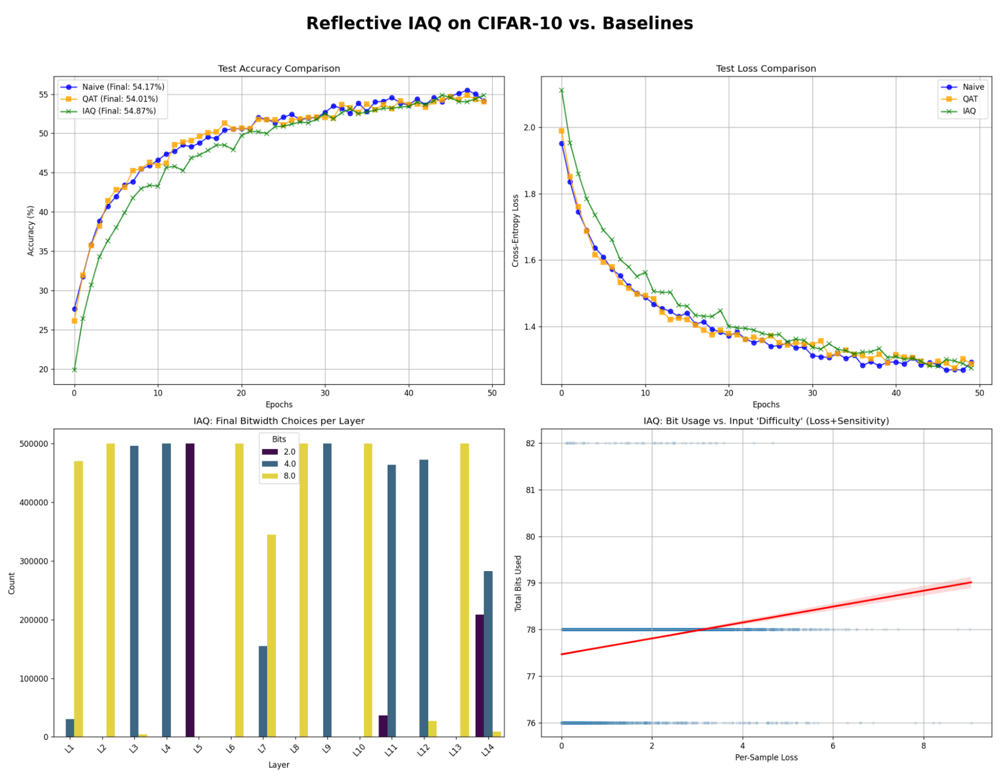
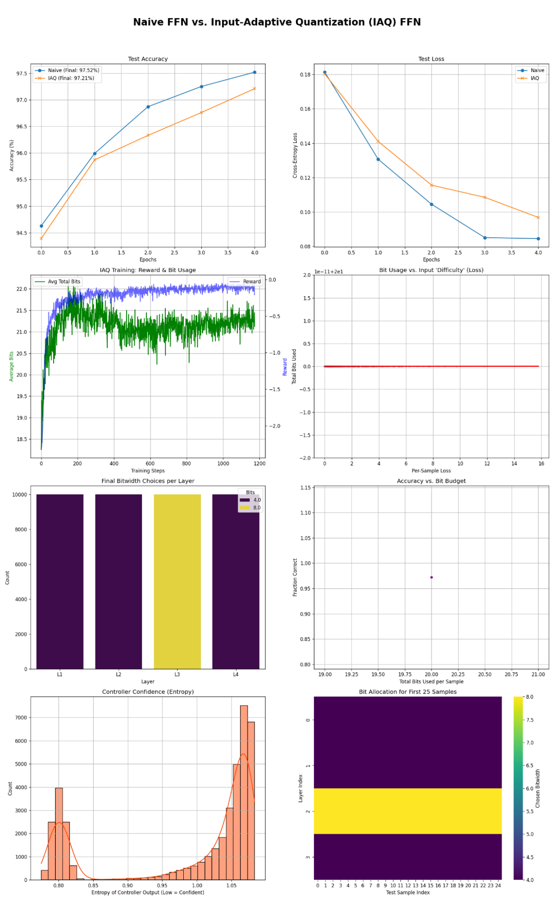
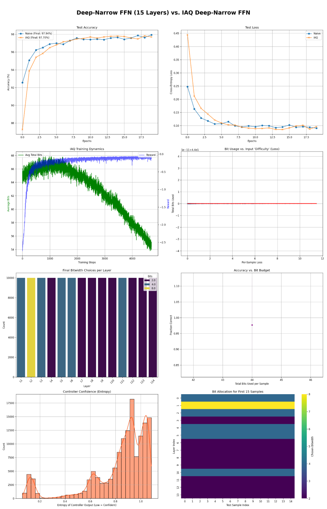
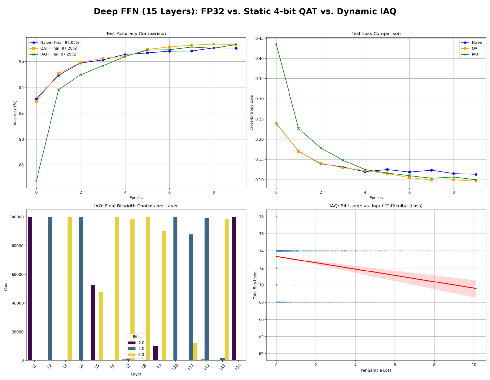
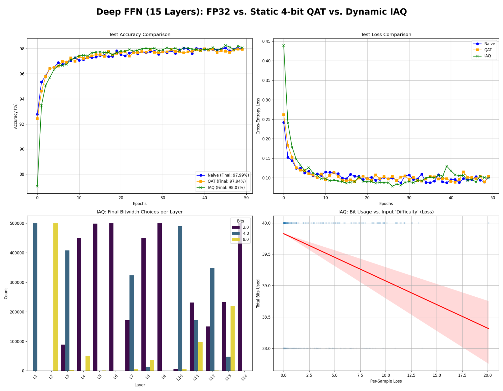
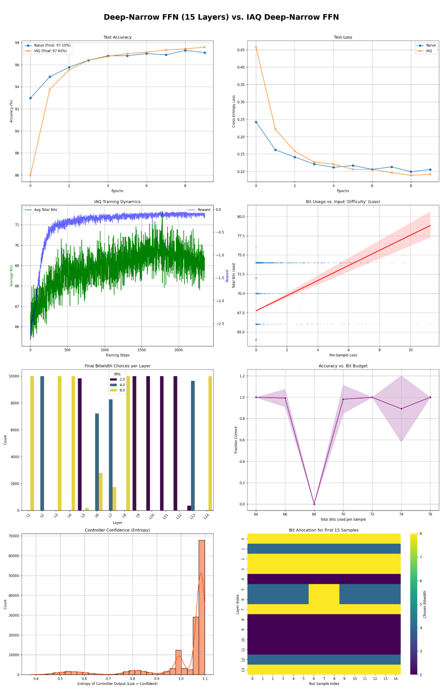
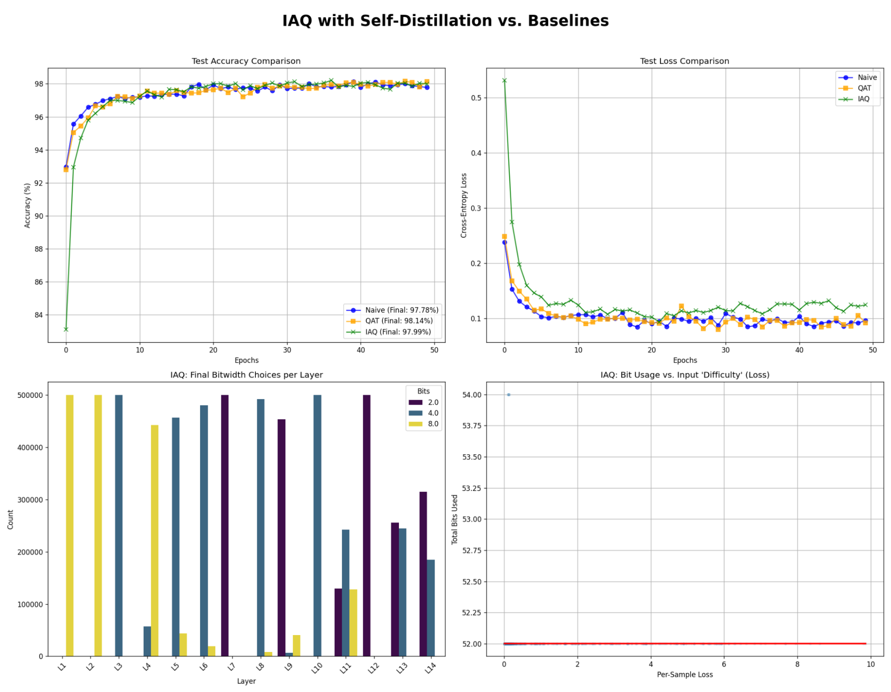
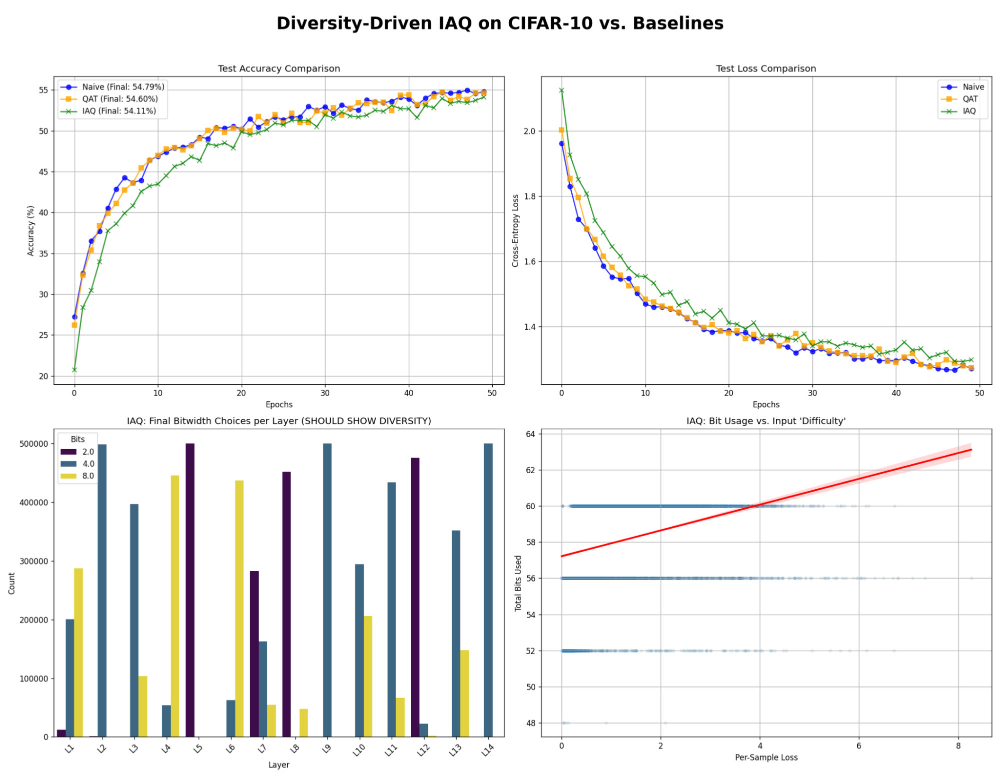

# Input-Adaptive Quantization (IAQ)

Input-Adaptive Quantization (IAQ) is an experimental reinforcement learning based quantization framework for dynamically allocating numerical precision in neural networks based on the difficulty or uncertainty of each inference sample. Instead of applying a fixed quantization scheme across all inputs and layers, IAQ allows the model to selectively increase or decrease precision where it is most beneficial.

The primary motivation behind IAQ is that traditional quantization techniques such as static post-training quantization or quantization-aware training (QAT) assume a uniform precision requirement across all inputs. In practice, however, different inputs impose very different computational demands. Many inputs can be processed accurately with extremely low precision, while others require higher precision to preserve model performance.

IAQ attempts to exploit this asymmetry by allocating precision dynamically, using information-theoretic signals such as entropy, uncertainty, or predictive divergence to determine where additional bits should be spent.

This repository contains an experimental prototype designed to study whether adaptive precision allocation can outperform traditional quantization approaches in terms of the accuracy–compression tradeoff.

---

# Motivation

Modern neural networks are frequently over-parameterized and operate with unnecessarily high numerical precision. Standard quantization methods (Such as QAT) reduce model size and compute cost by converting weights and activations to lower bit representations such as INT8 or INT4.

However, static quantization introduces two limitations:

1. **Uniform precision allocation** – every layer and every input receives the same numerical precision.
2. **Worst-case optimization** – precision is chosen to avoid degradation on difficult inputs, wasting compute on easier ones.

IAQ addresses this by introducing an adaptive mechanism that determines how much precision should be allocated for a given input and layer.

The central hypothesis is that model precision can be treated as a limited computational resource and distributed dynamically according to estimated information requirements.

---

# Core Idea

IAQ introduces a precision controller that selects a bitwidth for each layer during inference.

Rather than fixing quantization at a constant level (e.g., INT4 or INT8), the model dynamically selects from a discrete set of precision levels:

```
{2, 4, 8, 16, 32} bits
```

The selection process is selected by a RL policy that considers:

* activation entropy
* predictive entropy
* uncertainty estimates
* KL divergence between precision levels

The RL controller allocates higher precision to layers or inputs that exhibit higher uncertainty or information density, while compressing easier computations into lower bit representations.

---

# Architecture Overview

The IAQ system consists of three primary components.

### 1. Base Model

A standard neural network architecture trained in full precision.
Initial experiments focus on simple feed-forward networks to study quantization behavior in isolation.

### 2. Quantization Operators

Each layer supports multiple quantized representations of weights and activations.

Example precision levels:

```
2-bit
4-bit
8-bit
16-bit
32-bit
```

Quantized kernels are implemented with shared scales and groupwise quantization to minimize overhead.

### 3. Precision Controller

A lightweight RL policy network selects the bitwidth used for each layer during inference.

Several controller variants are explored:

* Reinforcement learning policies (Selected)
* Bayesian uncertainty estimators
* entropy-based heuristics
* information-gain thresholds
* variational latent precision models

---

# Precision Selection Strategies

This repository explores several candidate approaches for selecting quantization levels.

## Entropy-Based Allocation

Activation entropy is used as a proxy for information density.

Higher entropy activations may require higher precision to avoid information loss.

For a layer activation vector (h):

```math
[
H(h) = -\sum p(h_i)\log p(h_i)
]
```

Bitwidth is then selected based on entropy thresholds.

---

## Bayesian Uncertainty Allocation

Epistemic uncertainty can be estimated using stochastic forward passes such as Monte Carlo dropout.

For layer activations 

```math
(h^{(t)}):
```

```math
[
\mathrm{Uncertainty} = \frac{1}{T} \sum_{t=1}^{T} ||h^{(t)} - \bar{h}||^2
]
```

Higher uncertainty values trigger higher precision. However we found this method to be inferior to others listed.

---

## Information Gain Check

A layer may first be evaluated at very low precision. If the resulting prediction entropy increases beyond a threshold, the layer is recomputed at higher precision.

This produces a dynamic feedback loop between precision and prediction stability.

---

## Variational Bitwidth Modeling

Bitwidth is treated as a latent categorical variable:

```math
[
b \in {2,4,8,16,32}
]
```

A posterior distribution (q(b|h)) is learned over bitwidths:

```math
[
\mathcal{L} =
\mathbb{E}_{q(b|h)}[-\log p(y|x,b)]
+
KL(q(b|h) || p(b))
]
```
The prior (p(b)) favors lower precision to encourage compression.

---

## Reinforcement Learning Controller

The precision controller can also be trained using reinforcement learning. This was the method that performed best and is thus used in the results section.

State:

```
activation statistics
layer index
input difficulty metrics
```

Action:

```
select bitwidth
```

Reward:

```
accuracy - λ * compute_cost
```

This encourages the controller to maximize predictive accuracy while minimizing total precision usage. Results indicated that as the RL policy learned to compress data, the model also better fit the data in less training steps.

---

# Experimental Goals

This repository focuses on exploring the following research questions:

* Can dynamic precision outperform static quantization methods such as QAT?
* How much accuracy can be preserved at extremely low average bitwidths?
* Which signals best predict when higher precision is necessary?
* What is the optimal granularity of precision adaptation (layer-level vs token-level)?

---

# Gallery

This section will showcase the empirical behavior of IAQ across several experiments.

Figures will include:

* accuracy vs average bitwidth
* IAQ vs QAT performance comparisons
* entropy vs selected bitwidth distributions
* precision allocation heatmaps across layers
* RL controller policy evolution during training

Results:










# Current Status

This repository is currently a "Paper as a repo".

Initial work emphasizes:

* feed-forward networks
* controlled quantization experiments
* controller policy analysis
* visualization of precision allocation patterns

The long-term goal is to extend IAQ to larger architectures such as transformers and evaluate its behavior on language modeling and sequence prediction tasks.

---

# Future Work

Potential research directions include:

* token-level precision allocation for transformer architectures
* hardware-aware adaptive kernels
* meta-learning quantization policies across tasks
* integration with pruning and sparsity methods
* uncertainty-aware inference for safety-critical applications

---

# License

This project is released under the MIT License.
